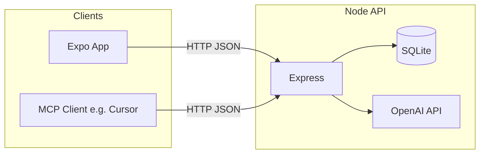

# VitaCare

VitaCare is a **health and wellness companion** stack: an **Expo (React Native)** mobile app, a **Node.js** HTTP API backed by **SQLite**, optional **OpenAI** features (chat, meal estimates, elderly insights, fitness coaching), and a **Model Context Protocol (MCP)** server so tools like Cursor can call the same API.

> **Disclaimer:** VitaCare is for wellness support and education. It does **not** diagnose, treat, or replace professional medical care. Data is stored locally on the server by default; treat deployments as **demo-grade** unless you harden security and compliance.

---

## Repository layout

```
.
├── mobile/           # Expo app (Expo Router, iOS/Android/Web)
├── server/           # Express API + SQLite (vitacare.sqlite)
├── vitacare-mcp/     # MCP stdio server → HTTP tools for Cursor/IDEs
├── .gitignore
└── README.md
```

| Package | Role |
|--------|------|
| **mobile** | User-facing app: tabs for Home, Elderly Care, Fitness, Nutrition, Wellness, Wearable, Assistant. Talks to `server` over HTTP. |
| **server** | REST API: persists logs, profiles, preferences; calls OpenAI where configured. Listens on `PORT` (default **3001**). |
| **vitacare-mcp** | Thin MCP layer: registers tools that `fetch` the same API (health, nutrition, fitness, elderly insight, chat, fine-tuning admin). |

---

## High-level architecture



- **Mobile** uses `EXPO_PUBLIC_API_URL` or `app.json` → `extra.apiUrl`, with platform defaults (`Android`: `10.0.2.2:3001`, else `127.0.0.1:3001`). See `mobile/lib/api.ts`.
- **SQLite** file lives at `server/data/vitacare.sqlite` (created on first run). The repo ignores `*.sqlite` via `.gitignore` / `server/.gitignore`.
- **MCP** points at the same base URL (`VITACARE_API_URL`, default `http://127.0.0.1:3001`). Fine-tuning admin routes require a shared secret header matching the API.

---

## Mobile app (`mobile/`)

- **Stack:** Expo ~54, Expo Router (file-based tabs), React Native, TypeScript.
- **Entry:** `expo-router/entry`; main screens under `app/(tabs)/`.

### Tab map (user flows)

| Tab | Purpose | Typical flow |
|-----|---------|----------------|
| **Home** | Dashboard / entry | Overview and navigation; info link to `modal`. |
| **Elderly Care** | Daily check-ins, vitals, activity, sleep, caregivers, alerts | User logs data → **POST** `/api/elderly/*` → AI **insight** via **GET** `/api/elderly/insight` (OpenAI on server). |
| **Fitness** | Profile, generated plan, sessions, coach | **PUT/GET** `/api/fitness/profile`, **POST** `/api/fitness/plan`, sessions and **POST** `/api/fitness/coach`. |
| **Nutrition** | Meal logging and daily summary | **POST** `/api/nutrition/logs` (macro estimates from model), **GET** summary and logs. |
| **Wellness** | Reminders, hydration, medications (server-backed prefs) | **GET/PUT** `/api/wellness/preferences`; hydration and meds endpoints. Local **expo-notifications** schedules from `notificationScheduler.ts` using those preferences. |
| **Wearable** | Apple Health sync (iOS) | Reads steps, HR, SpO₂, sleep via `@kayzmann/expo-healthkit`, then pushes to elderly vitals/activity/sleep APIs. **Expo Go** does not include the native HealthKit build; use a **dev build** (`expo prebuild` + run on device). |
| **Assistant** | Voice/text wellness chat | **POST** `/api/chat`; optional **POST** `/api/chat/transcribe` with audio (Whisper on backend). Uses `expo-av` for recording where applicable. |

Supporting libraries:

- `lib/api.ts` — typed client for all backend routes.
- `lib/notificationScheduler.ts` — maps wellness preferences + medications to **local** scheduled notifications.
- `lib/careAlerts.ts` — care-alert helpers used with elderly flows.
- `lib/wearableHealth*.ts` — platform-specific wearable sync (iOS implementation in `wearableHealth.ios.ts`).

---

## HTTP API (`server/`)

- **Runtime:** Node with ESM (`"type": "module"`), `tsx` for dev.
- **Framework:** Express + `cors` + JSON body parsing.
- **Persistence:** `better-sqlite3`; schema in `src/db.ts` (check-ins, nutrition, vitals, activity, sleep, caregivers, alerts, fitness, wellness, etc.).

### Route groups

| Prefix | Responsibility |
|--------|----------------|
| `GET /health` | Liveness: `{ ok, service }`. |
| `/api/elderly` | Check-ins, vitals, activity, sleep, caregivers, alerts, **AI insight** (`aiInsights` + personal context). |
| `/api/nutrition` | Meal logs and daily totals; **OpenAI** for estimates / tips (optional fine-tuned model via `OPENAI_MEAL_MODEL`). |
| `/api/fitness` | Profile, AI **plan** and **coach**, session logs. |
| `/api/wellness` | Reminder preferences, hydration, medications, summary. |
| `/api/chat` | Chat completions; **transcribe** uploads audio to OpenAI. |
| `/api/finetune` | Admin-only nutrition fine-tune pipeline (secret header). |

### Environment (copy `server/.env.example` → `server/.env`)

| Variable | Purpose |
|----------|---------|
| `PORT` | API port (default `3001`). |
| `OPENAI_API_KEY` | Required for chat, insight, nutrition AI, fitness AI, Whisper. |
| `OPENAI_CHAT_MODEL` | Chat model id (e.g. `gpt-4o`). |
| `OPENAI_MEAL_MODEL` | Optional `ft:...` for meal logging. |
| `FINETUNE_ADMIN_SECRET` | Shared secret for `/api/finetune/*`; must match MCP `VITACARE_FINETUNE_SECRET`. |
| `OPENAI_FINETUNE_BASE_MODEL` | Base model for fine-tune jobs. |

Run locally:

```bash
cd server
cp .env.example .env   # then edit .env — never commit real keys
npm install
npm run dev
```

---

## MCP package (`vitacare-mcp/`)

- Exposes the VitaCare API as **MCP tools** (stdio transport) for editors/agents that support MCP.
- **Prerequisite:** API running unless you only call `vitacare_health` against a reachable host.
- **Env:** `VITACARE_API_URL` (default `http://127.0.0.1:3001`), `VITACARE_FINETUNE_SECRET` for fine-tune tools.

See `vitacare-mcp/README.md` for tool names and Cursor wiring notes.

---

## End-to-end flows (quick reference)

1. **Daily elderly check-in**  
   App → `POST /api/elderly/check-ins` → SQLite → optional `GET /api/elderly/insight` → OpenAI returns brief + warnings.

2. **Log a meal**  
   App → `POST /api/nutrition/logs` → server stores row + AI-estimated macros → `GET /api/nutrition/summary/today` for totals.

3. **Fitness week plan**  
   App → `POST /api/fitness/plan` (profile + history from DB) → structured plan JSON → user logs sessions via `POST /api/fitness/sessions`.

4. **Wellness reminders**  
   App loads/saves `PUT /api/wellness/preferences` → `rescheduleAllNotifications` schedules **local** notifications; optional server summary for hydration/check‑ins/meds.

5. **Wearable sync (iOS)**  
   HealthKit read → map to vitals/activity/sleep → same elderly endpoints as manual entry.

6. **Assistant**  
   User message or recorded audio → `/api/chat` or `/api/chat/transcribe` + `/api/chat` → assistant reply in app.

7. **MCP / Cursor**  
   MCP tool → HTTP `GET/POST` to running API → same data as the app (no duplicate business logic).

---

## Local development

1. **API:** `cd server && npm install && npm run dev`
2. **App:** `cd mobile && npm install && npm start` — use Expo Go or a dev build; point API URL via `EXPO_PUBLIC_API_URL` or `app.json` `extra.apiUrl` if not using localhost defaults.
3. **MCP (optional):** `cd vitacare-mcp && npm install && npm start` — configure your MCP client to launch this process with env vars set.

---

## Security notes

- Never commit `.env` or real API keys. `server/.env.example` uses placeholders only.
- `FINETUNE_ADMIN_SECRET` protects `/api/finetune/*`; use a long random value in production.
- For production deployment, add **HTTPS**, **authentication**, backups, and a threat model appropriate to health-adjacent data.

---

## License

Private / project-specific unless you add a license file. Add a `LICENSE` at the repo root if you open-source the project.

---

## Links

- **Remote:** [github.com/thensanity/VitaCare](https://github.com/thensanity/VitaCare)
